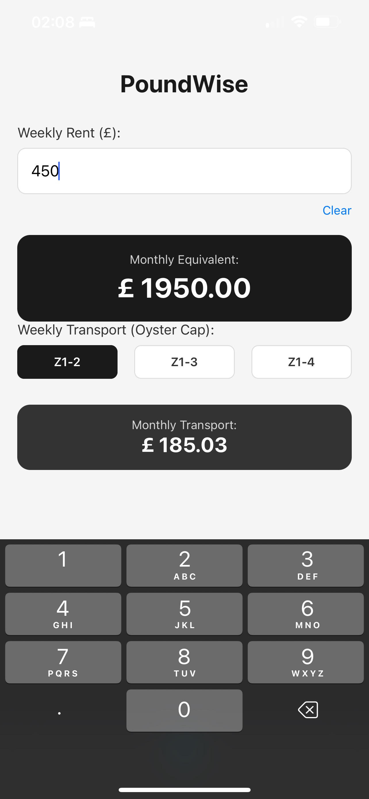

# 💷 PoundWise

<p align="center">
  
</p>

**PoundWise** é uma calculadora financeira especializada para brasileiros que estão planejando ou vivendo em Londres. O app ajuda a converter custos de moradia e transporte (Oyster Caps) de forma rápida e precisa.

---

## 🚀 Funcionalidades (Roadmap)

- [x] **FEAT-01**: Conversão de Aluguel Semanal para Mensal.
- [x] **FEAT-02**: Interface Limpa e Campo de Limpeza Rápida.
- [x] **FEAT-03**: Calculadora de Transporte (TFL London Zones 1-4).
- [ ] **FEAT-04**: Conversor Consolidado BRL/GBP (Em desenvolvimento).

## 🛠️ Tecnologias Utilizadas

- **React Native** com **Expo** (SDK 52+).
- **TypeScript** para tipagem e segurança de código.
- **Expo Router** para navegação baseada em arquivos.
- **Context & Constants**: Centralização de regras de negócio (Preços da TFL).

## 📱 Como Rodar o Projeto

1. Instale as dependências:
   ```bash
   npm install
2. Inicie o servidor do Expo:
   ```bash
   npx expo start

3. Escaneie o QR Code com o app Expo Go (Android) ou a câmera (iOS).

🧠 O que aprendi neste projeto
Este projeto foi focado em aplicar padrões de mercado (Clean Code), como:

Componentização: Divisão de UI para facilitar a manutenção.

UX Nativa: Uso de KeyboardAvoidingView e ScrollView para navegação fluida em dispositivos móveis.

Gestão de Constantes: Centralização de valores "mágicos" para facilitar atualizações futuras de preços da TFL.

Desenvolvido com ☕ e foco no mercado de Londres.
